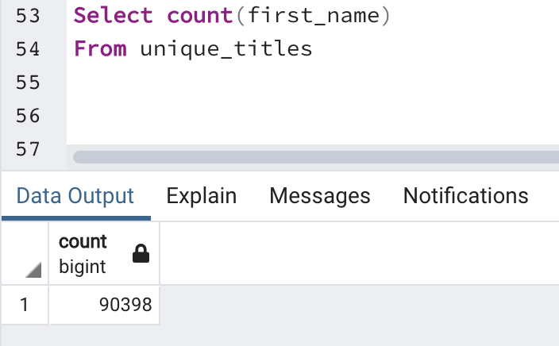
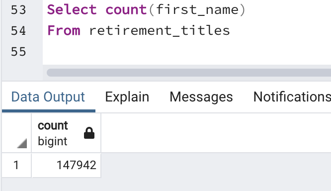
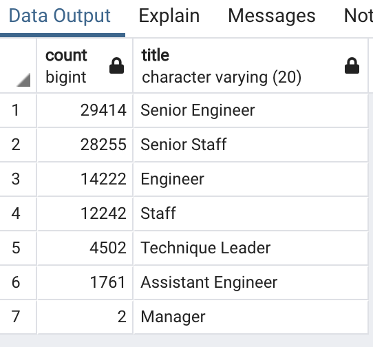
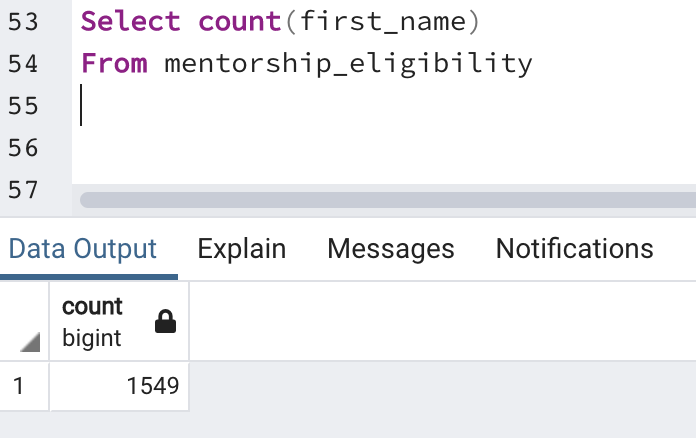
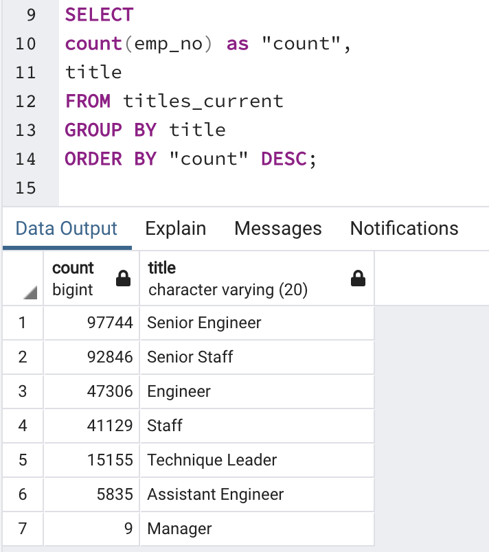
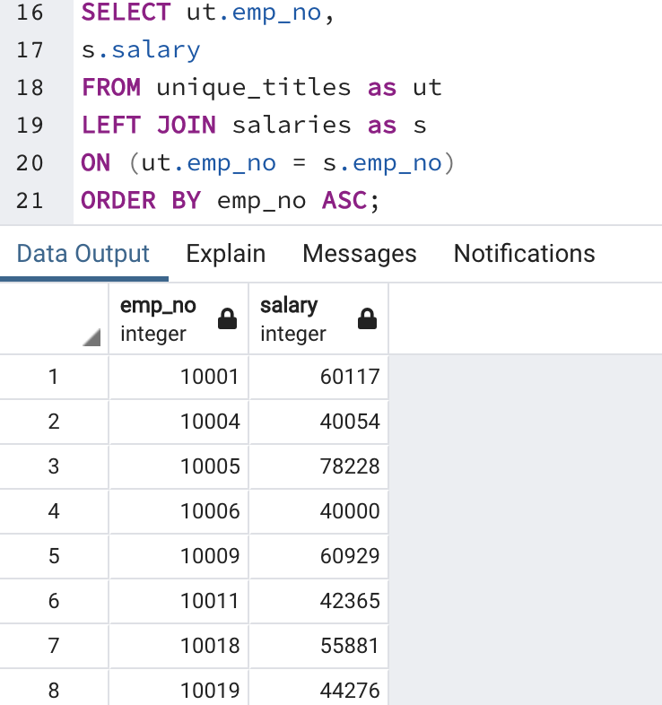

## Pewlett Hackard Analysis
### Overview
As many employees will be retiring from the company upon reaching retirement age, the client asked for a SQL query to determine the number of employees who are retiring based on their titles.  In addition, the client asked for a SQL query to identify current employees who are eligible for the mentorship program.

## Results
- Nearly 90,400 employees will be retiring based on the unique titles table.

- However, there were nearly 148,000 employees listed in the retirement titles table.  This shows that many employees who are retiring have held different titles at the company. Either signaling career progression or change of roles. 

- Most of the employees who will be retiring have a current title of Senior Engineer or Senior Staff.

- There are over 1,500 current employees who are eligible for the mentorship program.

## Summary
- About 90,400 employees will be retiring so all of these roles will need to be filled.
- There are about 90,400 employees ready to retire and only 1,500 employees are eligible for mentorship.  Thus there are enough qualified, retirement-ready employees in the departments to mentor the next generation of Pewlett Hackard employees.

Two additional queries that could be used for further analysis are:
1. Looking at the number of employees at a given position compared to the number of employees that will retire from those positions gives insight into what positions will be short-staffed.

2. Seeing the salaries for the employees who are retiring will help the company prepare financially for new hires and managing slarary increases as mentees are promoted or take on more responsibilities.

*Both of these query outputs could be put into a table by using the INTO table_name SQL function. 
